# События

Одной из главных особенностей NeoForge является система событий. События срабатывают для различных действий, происходящих в игре. Например, существуют события для правого клика игрока, прыжка игрока или другой сущности, рендеринга блоков, загрузки игры и т.д. Моддер может подписывать обработчики событий на каждое из этих событий и затем реализовывать желаемое поведение внутри этих обработчиков.

События вызываются на соответствующей шине событий. Наиболее важной шиной является `NeoForge.EVENT_BUS`, также известная как **игровая** шина. Кроме того, во время запуска для каждого загруженного мода создается шина мода и передается в конструктор мода. Многие события шины мода вызываются параллельно (в отличие от событий основной шины, которые всегда выполняются в одном потоке), что значительно увеличивает скорость запуска. См. [ниже](#шины-событий) для получения дополнительной информации.

## Регистрация обработчика событий

Существует несколько способов регистрации обработчиков событий. Общим для всех этих способов является то, что каждый обработчик событий — это метод с одним параметром события и без результата (т.е. возвращаемый тип `void`).

### `IEventBus#addListener`

Самый простой способ зарегистрировать обработчики методов — это зарегистрировать ссылку на метод, вот так:

```java
@Mod("yourmodid")
public class YourMod {
    public YourMod(IEventBus modBus) {
        NeoForge.EVENT_BUS.addListener(YourMod::onLivingJump);
    }

    // Исцеляет сущность на полсердца каждый раз, когда она прыгает.
    private static void onLivingJump(LivingEvent.LivingJumpEvent event) {
        LivingEntity entity = event.getEntity();
        // Исцелять только на стороне сервера
        if (!entity.level().isClientSide()) {
            entity.heal(1);
        }
    }
}
```

### `@SubscribeEvent`

Альтернативно, обработчики событий могут быть управляемыми аннотациями путем создания метода обработчика событий и аннотирования его с помощью `@SubscribeEvent`. Затем вы можете передать экземпляр охватывающего класса в шину событий, зарегистрировав все обработчики событий этого экземпляра, аннотированные `@SubscribeEvent`:

```java
public class EventHandler {
    @SubscribeEvent
    public void onLivingJump(LivingEvent.LivingJumpEvent event) {
        LivingEntity entity = event.getEntity();
        if (!entity.level().isClientSide()) {
            entity.heal(1);
        }
    }
}

@Mod("yourmodid")
public class YourMod {
    public YourMod(IEventBus modBus) {
        NeoForge.EVENT_BUS.register(new EventHandler());
    }
}
```

Вы также можете сделать это статически. Просто сделайте все обработчики событий статическими и вместо экземпляра класса передайте сам класс:

```java
public class EventHandler {
	@SubscribeEvent
    public static void onLivingJump(LivingEvent.LivingJumpEvent event) {
        LivingEntity entity = event.getEntity();
        if (!entity.level().isClientSide()) {
            entity.heal(1);
        }
    }
}

@Mod("yourmodid")
public class YourMod {
    public YourMod(IEventBus modBus) {
        NeoForge.EVENT_BUS.register(EventHandler.class);
    }
}
```

### `@EventBusSubscriber`

Мы можем пойти еще дальше и также аннотировать класс обработчика событий с помощью `@EventBusSubscriber`. Эта аннотация автоматически обнаруживается NeoForge, что позволяет вам удалить весь код, связанный с событиями, из конструктора мода. По сути, это эквивалентно вызову `NeoForge.EVENT_BUS.register(EventHandler.class)` в конце конструктора мода. Это означает, что все обработчики также должны быть статическими.

Хотя это и не обязательно, настоятельно рекомендуется указывать параметр `modid` в аннотации, чтобы облегчить отладку (особенно при конфликтах модов).

```java
@EventBusSubscriber(modid = "yourmodid")
public class EventHandler {
    @SubscribeEvent
    public static void onLivingJump(LivingEvent.LivingJumpEvent event) {
        LivingEntity entity = event.getEntity();
        if (!entity.level().isClientSide()) {
            entity.heal(1);
        }
    }
}
```

## Параметры Событий

### Поля и Методы

Поля и методы, вероятно, являются самой очевидной частью события. Большинство событий содержат контекст для использования обработчиком событий, такой как сущность, вызывающая событие, или уровень, на котором происходит событие.

### Иерархия

Чтобы использовать преимущества наследования, некоторые события не расширяют напрямую `Event`, а один из его подклассов, например `BlockEvent` (который содержит контекст блока для событий, связанных с блоками) или `EntityEvent` (который аналогично содержит контекст сущности) и его подклассы `LivingEvent` (для контекста, специфичного для `LivingEntity`) и `PlayerEvent` (для контекста, специфичного для `Player`). Эти предоставляющие контекст супер-события являются `abstract` и не могут быть прослушаны.

> **Опасно:**
> Если вы будете слушать `abstract` событие, ваша игра вылетит, так как это никогда не то, что вам нужно. Всегда нужно слушать одно из подсобытий.

```mermaid
graph TD;
    Event --> BlockEvent;
    BlockEvent --> BlockDropsEvent;
    Event --> EntityEvent;
    EntityEvent --> LivingEvent;
    LivingEvent --> PlayerEvent;
    PlayerEvent --> CanPlayerSleepEvent;

    classDef red fill:#47251F,stroke:#333,stroke-width:2px;
    classDef blue fill:#1F1F47,stroke:#333,stroke-width:2px;
    class Event,BlockEvent,EntityEvent,LivingEvent,PlayerEvent red;
    class BlockDropsEvent,CanPlayerSleepEvent blue;
```



### Отменяемые События

Некоторые события реализуют интерфейс `ICancellableEvent`. Эти события могут быть отменены с помощью `#setCanceled(boolean canceled)`, а статус отмены можно проверить с помощью `#isCanceled()`. Если событие отменено, другие обработчики этого события не будут запущены, и будет включено некоторое поведение, связанное с "отменой". Например, отмена `LivingChangeTargetEvent` предотвратит изменение целевой сущности для данной сущности.

Обработчики событий могут явно выбирать получение отмененных событий. Это делается путем установки булевого параметра `receiveCanceled` в `IEventBus#addListener` (или `@SubscribeEvent`, в зависимости от вашего способа присоединения обработчиков событий) в значение true.

### TriStates и Results

Некоторые события имеют три потенциальных состояния возврата, представленных `TriState`, или перечислением `Result` непосредственно в классе события. Состояния возврата обычно могут либо отменять действие, обрабатываемое событием (`TriState#FALSE`), либо принудительно запускать действие (`TriState#TRUE`), либо выполнять стандартное поведение Vanilla (`TriState#DEFAULT`).

Событие с тремя потенциальными состояниями возврата имеет некоторый метод `set*` для установки желаемого исхода.

```java
// В некотором классе, где слушатели подписаны на игровую шину событий

@SubscribeEvent
public void renderNameTag(RenderNameTagEvent.CanRender event) {
    // Использует TriState для установки состояния возврата
    event.setCanRender(TriState.FALSE);
}

@SubscribeEvent
public void mobDespawn(MobDespawnEvent event) {
    // Использует перечисление Result для установки состояния возврата
    event.setResult(MobDespawnEvent.Result.DENY);
}
```

### Приоритет

Обработчикам событий опционально может быть назначен приоритет. Перечисление `EventPriority` содержит пять значений: `HIGHEST`, `HIGH`, `NORMAL` (по умолчанию), `LOW` и `LOWEST`. Обработчики событий выполняются от наивысшего к наинизшему приоритету. Если у них одинаковый приоритет, они срабатывают в порядке регистрации на основной шине, что примерно связано с порядком загрузки модов, и в точном порядке загрузки модов на шине мода (см. ниже).

Приоритеты можно определить, установив параметр `priority` в `IEventBus#addListener` или `@SubscribeEvent`, в зависимости от того, как вы присоединяете обработчики событий. Обратите внимание, что приоритеты игнорируются для событий, которые вызываются параллельно.

### События для Конкретной Стороны

Некоторые события вызываются только на одной [стороне](../Concepts/Sides.md). Распространенными примерами являются различные события рендеринга, которые вызываются только на клиенте. Поскольку события только для клиента обычно должны обращаться к другим частям кодовой базы Minecraft, существующим только на клиенте, их необходимо регистрировать соответствующим образом.

Обработчики событий, использующие `IEventBus#addListener()`, должны проверять текущую физическую сторону через `FMLEnvironment.dist` или параметр `Dist` в конструкторе вашего мода и добавлять слушателя в отдельном классе только для клиента, как описано в статье о [сторонах](../Concepts/Sides.md).

Обработчики событий, использующие `@EventBusSubscriber`, могут указывать сторону как параметр `value` аннотации, например `@EventBusSubscriber(value = Dist.CLIENT, modid = "yourmodid")`.

## Шины Событий

Хотя большинство событий публикуются на `NeoForge.EVENT_BUS`, некоторые события публикуются на шине событий мода. Их обычно называют событиями шины мода. События шины мода можно отличить от обычных событий по их суперинтерфейсу `IModBusEvent`.

Шина событий мода передается вам в качестве параметра в конструкторе мода, и вы можете затем подписывать на нее события шины мода. Если вы используете `@EventBusSubscriber`, вы также можете установить шину в качестве параметра аннотации, например: `@EventBusSubscriber(bus = Bus.MOD, modid = "yourmodid")`. Шина по умолчанию — `Bus.GAME`.

### Жизненный Цикл Мода

Большинство событий шины мода являются так называемыми событиями жизненного цикла. События жизненного цикла выполняются один раз в жизненном цикле каждого мода во время запуска. Многие из них вызываются параллельно путем подклассирования `ParallelDispatchEvent`; если вы хотите выполнить код из одного из этих событий в основном потоке, поставьте его в очередь с помощью `#enqueueWork(Runnable runnable)`.

Жизненный цикл обычно следует такому порядку:

*   Вызывается конструктор мода. Регистрируйте свои обработчики событий здесь или на следующем шаге.
*   Вызываются все `@EventBusSubscriber`.
*   Вызывается `FMLConstructModEvent`.
*   Вызываются события реестра, включая [`NewRegistryEvent`](../Concepts/Registries.md#пользовательские-реестры), [`DataPackRegistryEvent.NewRegistry`](../Concepts/Registries.md#пользовательские-реестры-пакетов-данных) и, для каждого реестра, [`RegisterEvent`](../Concepts/Registries.md#registerevent).
*   Вызывается `FMLCommonSetupEvent`. Здесь происходит различная прочая настройка.
*   Вызывается настройка для [конкретной стороны](../Concepts/Sides.md): `FMLClientSetupEvent`, если на физическом клиенте, и `FMLDedicatedServerSetupEvent`, если на физическом сервере.
*   Обрабатываются `InterModComms` (см. ниже).
*   Вызывается `FMLLoadCompleteEvent`.

#### `InterModComms`

`InterModComms` — это система, которая позволяет моддерам отправлять сообщения другим модам для реализации функций совместимости. Класс хранит сообщения для модов, все методы потокобезопасны для вызова. Система в основном управляется двумя событиями: `InterModEnqueueEvent` и `InterModProcessEvent`.

Во время `InterModEnqueueEvent` вы можете использовать `InterModComms#sendTo` для отправки сообщений другим модам. Эти методы принимают идентификатор мода, которому отправляется сообщение, ключ, связанный с данными сообщения (для различения разных сообщений), и `Supplier`, содержащий данные сообщения. Отправитель также может быть указан опционально.

Затем, во время `InterModProcessEvent`, вы можете использовать `InterModComms#getMessages` для получения потока всех полученных сообщений в виде объектов `IMCMessage`. Они содержат отправителя данных, предполагаемого получателя данных, ключ данных и поставщика для фактических данных.

### Другие События Шины Мода

Помимо событий жизненного цикла, существует несколько прочих событий, которые вызываются на шине событий мода, в основном по историческим причинам. Это, как правило, события, где вы можете регистрировать, настраивать или инициализировать различные вещи. Большинство этих событий не выполняются параллельно, в отличие от событий жизненного цикла. Несколько примеров:

*   `RegisterColorHandlersEvent.Block`, `.ItemTintSources`, `.ColorResolvers`
*   `ModelEvent.BakingCompleted`
*   `TextureAtlasStitchedEvent`

> **Предупреждение:**
> Планируется, что большинство этих событий будут перенесены на игровую шину событий в будущей версии.

---
<div align="center"><table border="1"><tr><td align="center">Предыдущий раздел<br><a href="./Sides.md">Стороны</a></td><td align="center">Следующий раздел<br><a href="../Blocks.md">Блоки</a></td></tr></table></div>
